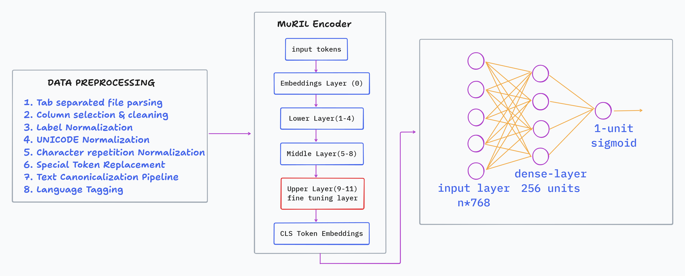

# Multilingual Offensive Language Detection

This repository contains the code and resources for detecting offensive language in multilingual text, specifically focusing on **Malayalam** and **Tamil**. The project leverages the **MuRIL** (Multilingual Representations for Indian Languages) model and explores various fine-tuning strategies, including standard fine-tuning, LoRA (Low-Rank Adaptation), and QLoRA (Quantized LoRA), to achieve efficient and accurate classification.

## Architecture



## Dataset

The dataset consists of offensive language data for Malayalam and Tamil, split into training, development (validation), and testing sets.

- **Malayalam**: `mal_full_offensive_train.csv`, `mal_full_offensive_dev.csv`, `mal_full_offensive_test.csv`
- **Tamil**: `tamil_offensive_full_train.csv`, `tamil_offensive_full_dev.csv`, `tamil_offensive_full_test.csv`

### Labels
- `0`: Not Offensive
- `1`: Offensive

## Data Preprocessing

The text data undergoes several preprocessing steps to ensure quality and consistency before being fed into the model:
1. **Label Normalization**: Converts string labels to binary integers (`0` for Not Offensive, `1` for Offensive).
2. **Unicode Normalization**: Applies NFC normalization to handle complex characters in Indian languages.
3. **Character Repeat Normalization**: Reduces excessive character repetitions (e.g., "hellooo" -> "helloo").
4. **Special Token Replacement**: Replaces URLs, user mentions, and numbers with special tokens (`<URL>`, `<USER>`, `<NUM>`).
5. **Language Tagging**: Prepends a language-specific tag (`<ml>` for Malayalam, `<ta>` for Tamil) to each text sequence.

## Model & Fine-Tuning Strategies

The core model used is `google/muril-base-cased`. A custom classification head is added on top of the `[CLS]` token representation, consisting of a linear layer, ReLU activation, dropout, and a final linear layer for binary classification.

The notebook (`MuRIL Selective Fine Tuning.ipynb`) implements three distinct fine-tuning approaches:

### 1. Selective Base Model Fine-Tuning
- Freezes the lower layers of the MuRIL encoder.
- Unfreezes only the top layers (layers 9, 10, and 11) and the classification head.
- Uses `BCEWithLogitsLoss` (or `BCELoss` with Sigmoid) and `AdamW` optimizer.

### 2. Parameter-Efficient Fine-Tuning (PEFT) using LoRA
- Implements Low-Rank Adaptation (LoRA) using the `peft` library.
- Targets the `query` and `value` attention modules.
- Significantly reduces the number of trainable parameters while maintaining performance.

### 3. Quantized LoRA (QLoRA)
- Loads the base MuRIL model in 4-bit precision using `bitsandbytes` (`nf4` quantization type, double quantization, and `bfloat16`/`float16` compute dtype).
- Applies LoRA adapters on top of the quantized model.
- Explores both selective target modules (`query`, `value`) and full-model target modules (`query`, `key`, `value`, `dense`) for maximum efficiency and performance on limited hardware.

## Requirements

To run the notebook, you will need the following libraries:
- `torch`
- `pandas`
- `numpy`
- `scikit-learn`
- `transformers`
- `peft`
- `accelerate`
- `bitsandbytes`
- `matplotlib`

You can install the required PEFT and quantization libraries using:
```bash
pip install transformers peft accelerate bitsandbytes
```

## Usage

1. Clone the repository.
2. Ensure the dataset files are located in the `offensive_dataset/` directory (or update the paths in the notebook accordingly).
3. Open `MuRIL Selective Fine Tuning.ipynb` in Jupyter Notebook, Google Colab, or VS Code.
4. Run the cells sequentially to preprocess the data, train the models, and evaluate their performance.
5. The best models are saved as `.pt` files (e.g., `best_muril_model.pt`, `LoRA_muril_model1.pt`, `qLoRA_muril_model1.pt`) during the training loop.

## Evaluation

The models are evaluated using:
- Binary Accuracy
- Classification Report (Precision, Recall, F1-Score)
- Confusion Matrix

Class weights are computed and applied to the loss function to handle any class imbalances in the dataset.